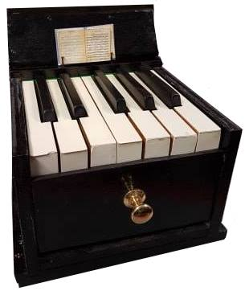

# MegaKey
## Full Octave Tactile Key

The physical "touch" or "feel" of acoustic keyboard instruments is a phenomenon explored extensively and one which contributes considerably to a musicians playing technique. The feel of different keyboard instruments vary widely, as different mechanical processes occur with every key stroke in order to make the sound. For example, the pluck of a harpsichord's mechanism will feel different to the piano's hammer being thrown to hit the string. Whilst preparing for recitals, or even in just everyday practice, the ability to experience how these different keyboards feel will make this preparation period much more valuable and provide the musician with a greater deal of assurance going into performances. 

Though systems are commercially available with the ability to alter the response of a keyboard between a set of pre-determined characteristics, no systems are known which accurately mimic the response of specific keyboard instruments.
Last year, a tactile keyboard key was devised which had the ability to simulate the dynamic response of a grand piano, organ and harpsichord.
This single key featured a solenoid, a distance sensor and an accelerometer, and used the position of the key in its trajectory, along with the acceleration at which the key was played, to vary the current in the solenoid. With the solenoid's armature attached to the key, this would produce a different "feel", for each instrument setting, at the player's finger. 

This year, the design was implemented over one octave (12 keys). This required a considerable downscaling in both the mechanical nature of the system as well as the system's power consumption. This was achieved through encapsulating the electronics within a compact wooden enclosure and implementing an extension spring system to account for a portion of the force feedback system. This removes the need for the solenoids to be operational at rest, reducing the overall power consumption of the keyboard. 

The direction of the current, and therefore the pull or push of the solenoids, are software controlled, dependent on the position of the key in its trajectory. This is detected by infrared sensors placed underneath each individual key. The necessary information for the control system is obtained from the analysis of various keyboard responses, thus allowing the system to imitate the action of a grand piano, a harpsichord and organ to a high degree of accuracy.

## Final Design

